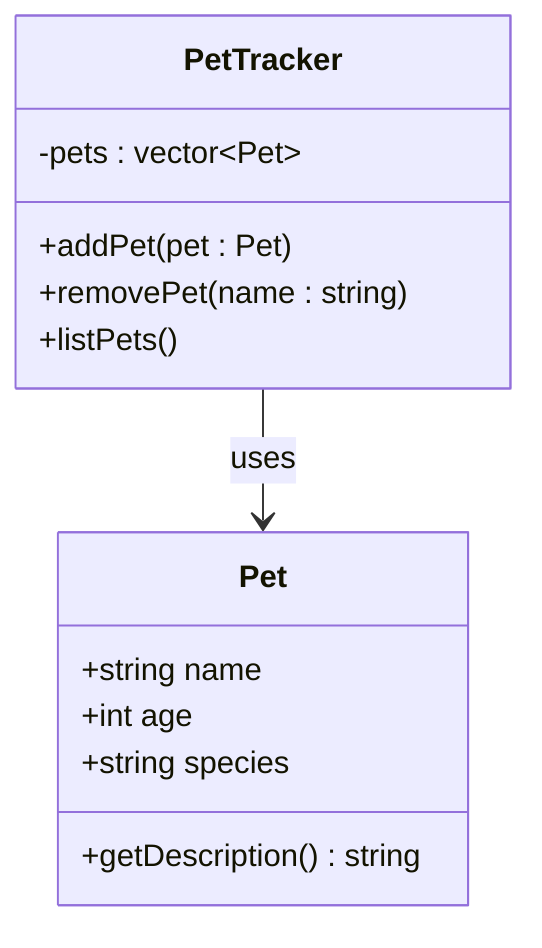

```mermaid
classDiagram
    class Pet {
        +string name
        +int age
        +string species
        +getDescription() string
    }
 
    class PetTracker {
        -pets : vector~Pet~
        +addPet(pet : Pet)
        +removePet(name : string)
        +listPets()
    }
 
    PetTracker --> Pet : uses
```